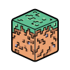

<p align="center">
  
</p>

<h1 align="center">LandCraft</h1>

<p align="center">
  A voxel game built from scratch in pure <b>Rust</b> using the <b>Bevy Engine</b>.
</p>

---

## About LandCraft

LandCraft is an open-source voxel sandbox game inspired by classic Minecraft. The project is focused on learning game engine architecture, procedural Perlin noise terrain, custom face-culling voxel meshing, and responsive AABB physics.

**Current Version:** `v0.1 Beta` (Under active development)

> **Theme:** Endless. The world has no boundaries. You can explore procedural rolling hills, break and place blocks, switch between first-person and third-person views, and travel infinitely.

---

## Controls

| Input | Action |
|---|---|
| <kbd>W</kbd> <kbd>A</kbd> <kbd>S</kbd> <kbd>D</kbd> | Move |
| <kbd>Space</kbd> | Jump |
| **Mouse Move** | Look around |
| **Left Click** | Break block |
| **Right Click** | Place selected block |
| <kbd>1</kbd> .. <kbd>9</kbd> | Select hotbar slot |
| <kbd>F2</kbd> | Toggle 1st / 3rd person camera |
| <kbd>Esc</kbd> | Exit game |

---

## Current Features

- **Procedural World**: Infinite chunk loader using 3-octave Perlin noise with continuous heightmaps.
- **Custom Voxel Mesher**: Real-time chunk mesh generation with automatic face culling (hidden interior faces are dropped to keep draw calls and triangle counts low).
- **AABB Physics**: Axis-by-axis collision resolution preventing edge-snagging, with gravity and grounded detection.
- **Raycast Interaction**: Precise block highlighting, breaking, and adjacent face block placement.
- **Player Model & Animation**: Rigged 3D avatar with animated walk/idle transitions and third-person camera mode.
- **HUD & Inventory**: Integrated crosshair, 9-slot hotbar with active slot indicator.

---

## Tech Stack

- **Language:** Rust (2024 Edition)
- **Game Engine:** [Bevy 0.19.1](https://bevyengine.org/)
- **Asset Bundling:** `bevy_embedded_assets`

---

## Getting Started

### Prerequisites

- Rust (latest stable toolchain) & Cargo
- A GPU with Vulkan, Metal, or OpenGL support

### Run Locally

```bash
# Clone the repository
git clone https://github.com/cyberworrier8088/LandCraft.git
cd LandCraft

# Run in debug mode
cargo run

# Run with full optimizations
cargo run --release
```

---

## Dev Logs

Progress is tracked daily as the engine evolves:

| Days | Highlights |
|---|---|
| [Day 0](day-0.md) | Project initialization, window setup |
| [Day 1](day-1.md) – [Day 5](day-5.md) | Camera controller, block models, world spawn |
| [Day 6-7](day-6-7.md) | Chunk system, texture atlas mapping |
| [Day 8-10](day-8-9-10.md) | Procedural Perlin noise terrain |
| [Day 11](day-11.md) – [Day 15](day-15.md) | Third-person rigged player model, animations, hotbar UI |
| [Day 16](day-16.md) | Physics refinement, voxel raycasting, Bevy 0.19.1 upgrade |

---

## License

This project is licensed under the [MIT License](LICENSE).
